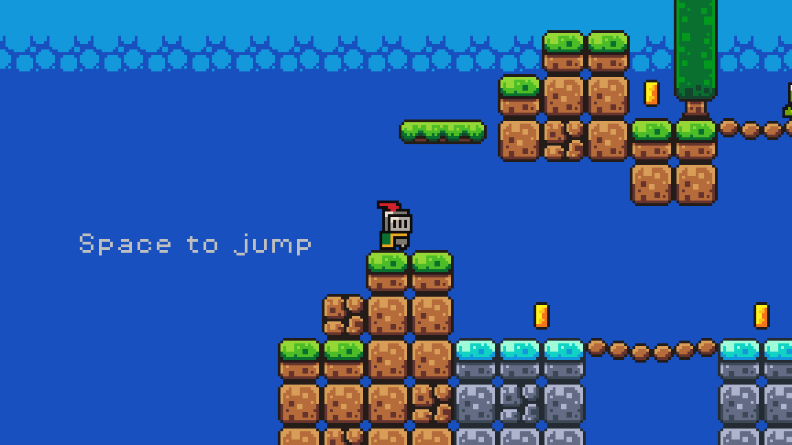

# Godot Game Platformer



A 2D platformer game created in Godot Engine for educational purposes and skill development in game development.

## About The Project

This is a classic 2D platformer game featuring a knight character navigating through various levels filled with enemies, collectibles, and challenges. The game demonstrates fundamental game development concepts including character movement, physics, collision detection, enemy AI, and game state management.

## Features

### 🎮 Core Gameplay

- **Responsive Character Movement** - Smooth player controls with running and jumping mechanics
- **Enemy System** - Multiple enemy types (slimes) with basic AI behavior
- **Collectible Items** - Coins and fruits to collect throughout levels
- **Platform Physics** - Realistic jumping and gravity mechanics
- **Hazard System** - Killzones and dangerous areas

### 🎨 Audio & Visual

- **Pixel Art Style** - Retro-inspired 8-bit graphics
- **Custom Sprites** - Knight character, enemies, platforms, and items
- **Sound Effects** - Jump, coin collection, hurt, explosion, and power-up sounds
- **Background Music** - Adventurous soundtrack to enhance gameplay

### 🏗️ Technical Features

- **Scene Management** - Modular scene-based architecture
- **Resource Management** - Efficient asset loading and organization
- **Game State Handling** - Proper game flow and state transitions

## Game Assets

### Characters & Entities

- **Knight** - Main playable character with animation
- **Slimes** - Green and purple enemy variants
- **Coins** - Collectible currency items
- **Fruits** - Bonus collectible items

### Environment

- **Platforms** - Various platform types and designs
- **World Tileset** - Complete tilemap for level design
- **Killzones** - Hazardous areas that reset player position

## Project Structure

```
godot-game-platformer/
├── assets/
│   ├── fonts/          # PixelOperator font family
│   ├── music/          # Background music tracks
│   ├── sounds/         # Sound effects
│   └── sprites/        # Character and environment sprites
├── scenes/             # Game scenes (.tscn files)
│   ├── coin.tscn
│   ├── game.tscn
│   ├── player.tscn
│   └── slime.tscn
└── scripts/            # GDScript files
    ├── player.gd
    ├── slime.gd
    ├── coin.gd
    └── game_manager.gd
```

## How to Play

### Controls

- **Arrow Keys / WASD** - Move left/right
- **Spacebar** - Jump
- **ESC** - Pause/Menu

### Objective

- Navigate through levels as the knight
- Collect coins and fruits for points
- Avoid or defeat slime enemies
- Reach the end of each level

## Development Setup

### Prerequisites

- **Godot Engine 4.x** - Download from [godotengine.org](https://godotengine.org/)

### Running the Game

1. Clone this repository
2. Open Godot Engine
3. Import the project by selecting the `project.godot` file
4. Press F5 or click "Play" to run the game

## Learning Outcomes

This project demonstrates understanding of:

- **2D Game Development** - Character controllers, physics, and collision systems
- **Godot Engine** - Scene system, nodes, and GDScript programming
- **Game Design** - Level design, player progression, and game mechanics
- **Asset Integration** - Sprite animation, audio implementation, and resource management
- **Code Organization** - Modular scripting and component-based architecture

## Technologies Used

- **Engine**: Godot 4.x
- **Language**: GDScript
- **Art Style**: Pixel Art
- **Audio**: WAV/MP3 format
- **Fonts**: PixelOperator (8-bit style)

## Credits

- **Development**: Personal learning project
- **Engine**: Godot Engine
- **Art Assets**: Various pixel art resources
- **Music**: "Time for Adventure" background track

---

_This project was created as part of a game development learning journey, focusing on understanding 2D platformer mechanics and Godot Engine capabilities._
